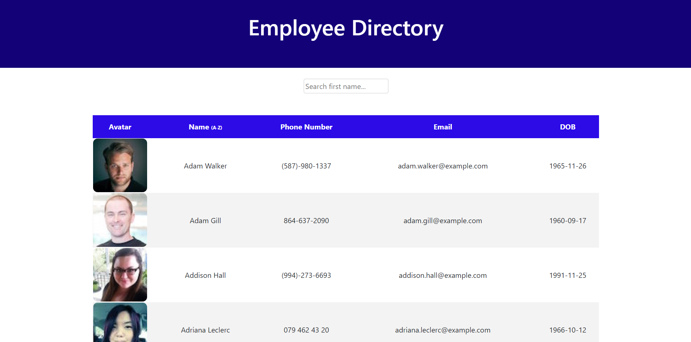

# EmployeeDirectory

  In this repository I created an application using React to display a list of employees. The user is able to sort the employees by ascending and descending order. The user is also able to search for employees using the search bar. As the user inputs and removes information from the search bar, the list of employees is automatically updated to display the employees that include whatever the user specifies.

This type of application is useful for an employee or manager that wants to view data about other employees.

[Here is a link to the application.](https://ethanl150.github.io/EmployeeDirectory/)

